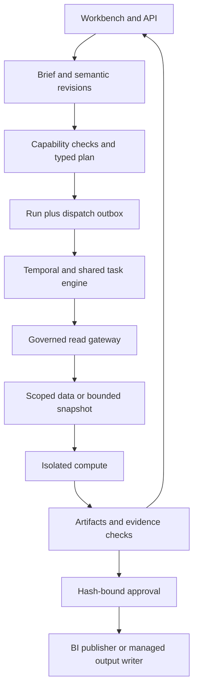

# ADR-0011 — Workspace-specific workflows and evidence

**Status:** proposed for implementation; design review 2026-09-25.
**Related:** ADR-0001 (monolith), ADR-0002 (closed vocabulary), ADR-0004/0010 (data access),
ADR-0005 (durability), ADR-0008 (verification). Existing behavior is unchanged until the tracked
increments ship. This ADR extends their scope; it does not authorize source writes.

## Context

The existing analyst run produces reproducible statistical findings and BI artifacts. General
engineering and ML work needs business semantics, stable data versions, differentiated evidence,
compute isolation and operational recovery. Adding more agents alone does not supply these.

## Decision

Keep FastAPI, Postgres and Temporal with package boundaries. Reuse policy, gateway, artifacts,
events and approvals across typed workflows. Add the following logical components inside the
monolith; these are not a mandate for new services.

| Boundary | Responsibility | Persistence and trust |
|---|---|---|
| Workspace intelligence | Versioned brief, semantics and reviewed corrections | Postgres revisions with owner/provenance; retrieval scoped by current access |
| Capability registry and planner | Map job/data prerequisites to a typed spec and readiness checks | Versioned code/config plus evaluation references; no model-granted permissions |
| Run execution | Dispatch, budgets, cancellation, checkpoints and reconciliation | Run + outbox transaction; Temporal retry-safe activities |
| Evidence verification | Facts, method-specific checks, freshness and evaluation | Immutable evidence linked to input/code/semantic versions |
| Compute worker | Bounded tabular transformations, experiments and scoring | Isolated job process/container, no source credentials or unrestricted network |
| Artifact storage | Datasets, model packages, reports and manifests | Registry in Postgres; authenticated blob adapter, checksums, retention and workspace isolation |
| Managed output writer | Approved materialization or scoring outputs | Separate destination-only identity, allowlisted target, verification immediately before effect |

Source extraction remains an authorized connector/staging operation; source-query SQL continues
through the gateway. Compute reads only a scoped immutable snapshot or governed aggregate,
never an alternate live database connection. Keep source reads and destination writes under
different identities. Cross-source joins require authorized per-source manifests and a governed
staging plan, rather than letting arbitrary federated SQL bypass validation.

## Reproducibility and data lifecycle

An execution manifest pins input/snapshot versions, observation interval when applicable,
semantic revision, spec/compiler version, code/environment digest, seeds and query evidence.
Blob writes use a temporary object plus digest verification before the registry makes them
visible; failed writes leave collectible orphans. Downloads resolve current authorization.
Do not persist arbitrary raw samples in the control plane to make replay convenient.

Use the existing artifact registry plus a storage adapter initially; select local or object
storage at deployment, with equivalent access checks. Retention applies to snapshots, features,
models, reports, caches and backups. If governed deletion removes replay data, retain permitted
audit metadata and mark the artifact non-replayable; do not claim indefinite reproducibility.

Budget reservations cover concurrent tasks before dispatch and settle to measured usage.
Enforce per-workspace concurrency and source-query quotas; cap experiment trials, wall time,
memory and storage. A worker crash must release/expire reservations through reconciliation.
Measure queue wait, dispatch lag, freshness, blocked work and accepted-output cost, not only LLM use.

## Evidence migration and consequences

Keep historical `verified` and confidence values with their verifier version. Add typed evidence
dimensions to new artifacts and label the legacy score as uncalibrated in the UI. Do not silently
upgrade old findings to confirmatory or predictive evidence. New ML and pipeline validators have
their own acceptance requirements and still obey the same scope/approval rules.

Advantages: one operational model, reusable evidence, gradual UI/API migration and a smaller
deployment surface. Costs: version/storage lifecycle, workflow-specific validators and stronger
compute isolation. Defer microservices, a separate feature store/ML platform and online serving
until measured scale or use cases justify them. Implementation and acceptance belong to
[P4–P6](../../60-delivery/01-tracker.md), not to this ADR's status.
